# 추영욱 *Yeonguk Choo*

I'm a passionate open source contributor, community organizer.  
I actively contribute to open source projects like Apache Airflow and Ubuntu, and help grow the communities around them.  

## Education

- **Korea Maritime & Ocean University (한국해양대학교)**  
  *B.S. in Data Science (Expected Dec 2025)*  

## Experience
- **Founder, arxtrus**  
  _Nov 2024 – Present_  

- **[Member of Ubuntu](https://launchpad.net/~ubuntumembers)**  
  _Jun 2024 – Present_  

## Community

- **Organizer, Apache Airflow Korea User Group**  
  _Dec 2023 – Present_  
  Hosting meetups, creating resources, and supporting Korean Airflow users.

- **Organizer, Ubuntu Korea Community**  
  _Apr 2023 – Present_  
  Supporting Ubuntu users in Korea through events, workshops, and outreach programs.

- **DebConf24 Local Team**  
  _Nov 2023 – Aug 2024_  
  Helped catering, conference dinner, publicity, daytrip, visa, and fundraising.

- **Co-Founder, SUSC**  
  _Mar 2023 – Present_  
  Co-founding a tech-driven student community to connect and empower student developers.

## OpenSource
- [Apache Airflow](https://github.com/apache/airflow/pulls?q=is%3Apr+author%3Achoo121600+)
- [Ubuntu](https://launchpad.net/~choo121600)

## :zap: Recent Activity
<!--START_SECTION:activity-->
1. 🗣 Commented on [#58762](https://github.com/apache/airflow/issues/58762#issuecomment-3584535014) in [apache/airflow](https://github.com/apache/airflow)
2. 💪 Opened PR [#58709](undefined) in [apache/airflow](https://github.com/apache/airflow)
3. 💪 Opened PR [#1290](undefined) in [apache/airflow-site](https://github.com/apache/airflow-site)
4. 🗣 Commented on [#1289](https://github.com/apache/airflow-site/pull/1289#issuecomment-3574822323) in [apache/airflow-site](https://github.com/apache/airflow-site)
5. 🗣 Commented on [#58637](https://github.com/apache/airflow/pull/58637#issuecomment-3573641884) in [apache/airflow](https://github.com/apache/airflow)
<!--END_SECTION:activity-->
